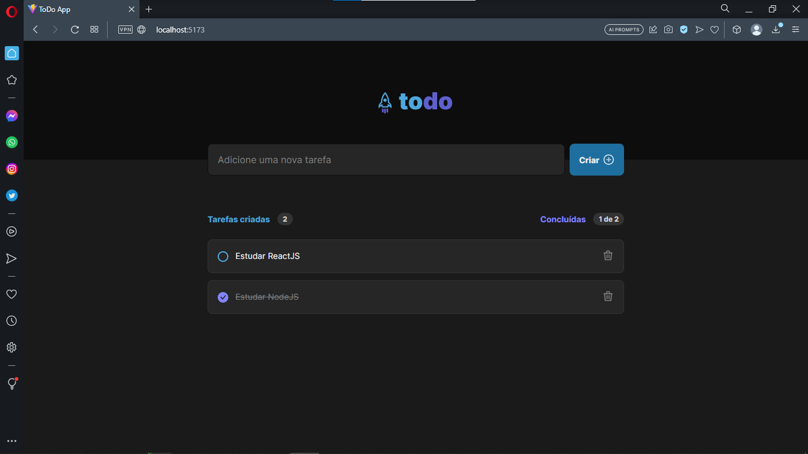
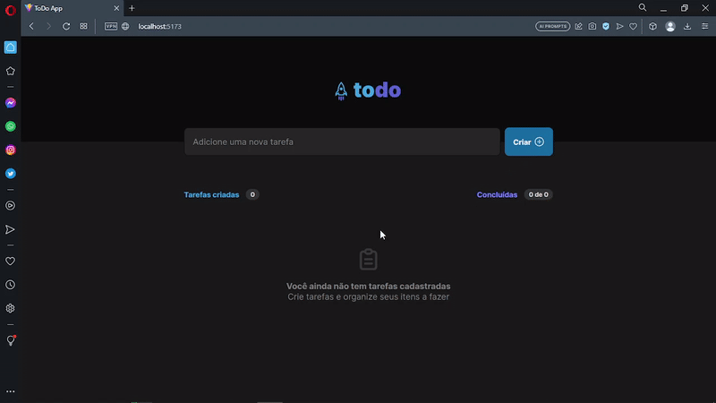

# TO DO React

<h1 align="center">
    
</h1>

<br>

### 💻 TO DO React

In this challenge, I developed a task control application in the style of **to-do list** , which contains the following functionalities:

- Add a new task
- Mark and unmark a task as done
- Remove a task from the list
- Show task completion progress
- Save list to localStorage

While this is some functionality, you will need to recall concepts such as:

- [x] React with Typescript;
- [x] Use the Vite;
- [x] localStorage 
- [x] hooks;
- [x] States(State immutability)
- [x] I used methods for manipulating arrays like map and filter.
- [x] Understanding the lists and keys in ReactJS
- [x] Properties
- [x] Components(Componentization)
- [x] Iterating in TSX
- [x] Include popular icons in my React projects easily with react-icons
- [x] Logic and Algorithms with Javascript(Typescript);
- [x] Style and format application CSS modules;
- [x] Building the application in blocks with components with the ReactJS tool;
- [x] A README.md file with specifications on how to run the project in a dev environment.
- [x] It meets the model proposed in Figma and contains elements indicative of action and state.
opcionais

### Accessing the app layout

After creating and logging into your account, you must duplicate the Challenge Layout. To do this, simply click on the link below. It will add the Layout to your Figma dashboard automatically as a copy and open the app layout for your viewing.

[ToDo List Figma](https://www.figma.com/file/0n0zDN7zbzhRbaEO74Xesx/ToDo-List/duplicate)


<br />

<p>TO DO React</p>


<br />
## 🧪 Tools

Application developed using the following tools:

- [React](https://react.dev/)
- [Vite](https://vitejs.dev/)
- [Typescript](https://www.typescriptlang.org/)
- [React Icons](https://react-icons.github.io/react-icons/)


## 🚀 Getting started

Clone Project and access folder and start the server it is necessary to have NodeJs, Git
installed and Visual Studio Code.

### Programs needed to Getting started

- [NodeJS](https://nodejs.org/en/)
- [Visual Studio Code - Vscode](https://code.visualstudio.com/)
- [Git](https://git-scm.com/)

<br />

### Install and start up

Clone the project and access the folder

```bash
# Clone this repository
$ git clone https://github.com/felipe-gomes-vicente/challenge-to-do-react.git

# Access the project folder in your terminal
$ cd challenge-to-do-react

# Install the dependencies
$ npm install

# Run the application in development mode
$ npm run dev

# The application will open on the port: 3000 - go to http://localhost:5173/ or http://127.0.0.1:5173/ 
```

<br />

## 📝 License

This project is under the MIT license. See the file [LICENSE](LICENSE) for more details.

---

&nbsp;

<p align="center">Done with 💜 by Felipe Vicente👋</p>

- ## My LinkedIn - [](https://www.linkedin.com/in/felipe-gomes-vicente/)
